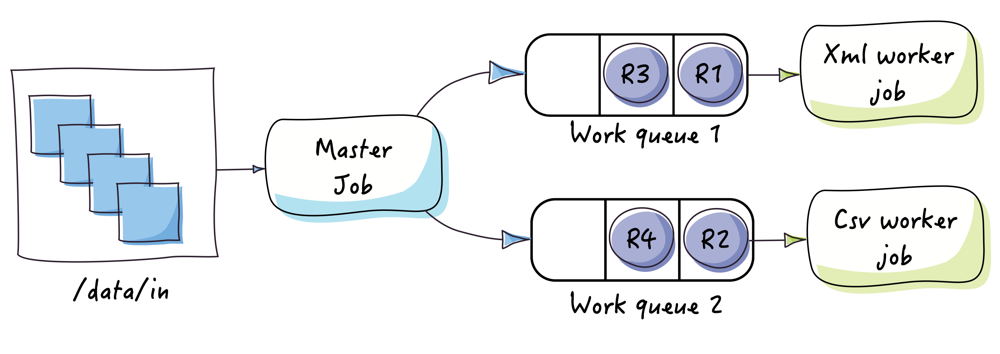

# Tutorial: Processing files in parallel based on their content

## Description

This tutorial is a show case of the `ContentBasedBlockingQueueRecordWriter`.
The goal is to process a directory containing multiple files and to dispatch these files to worker jobs based on their content type:

<div align="center">
    
</div>

Input files are processed in parallel using multiple queues.

## Run the tutorial

First, make sure you have already downloaded the source code and built the tutorials
as described in the [quick start](https://github.com/j-easy/easy-batch/tree/master/easy-batch-tutorials#quick-start) section.

### From the command line

Open a terminal and run the following command:

```
$>mvn exec:java -PrunFilesParallelProcessingTutorial
```

### From Your IDE

* Navigate to the `org.jeasy.batch.tutorials.advanced.cbrd.files` package
* Run the `org.jeasy.batch.tutorials.advanced.cbrd.files.Launcher` class without any argument
